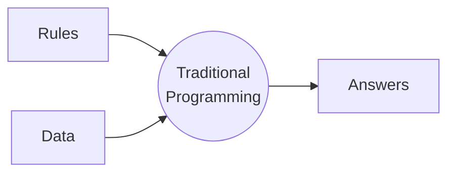
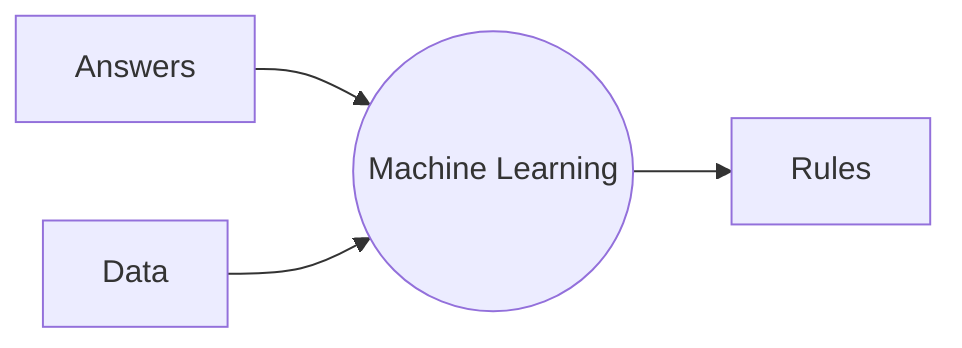

---
# try also 'default' to start simple
theme: seriph
fonts:
  sans: 'Tinos'
  serif: 'Tinos'
  mono: 'Space Mono'
  italic: true
# random image from a curated Unsplash collection by Anthony
# like them? see https://unsplash.com/collections/94734566/slidev
background: https://cdn.pixabay.com/photo/2018/05/08/08/46/artificial-intelligence-3382509_960_720.png
# apply any windi css classes to the current slide
class: 'text-center'
# https://sli.dev/custom/highlighters.html
highlighter: shiki
# show line numbers in code blocks
lineNumbers: true
# some information about the slides, markdown enabled
info: |
  ## Slidev Starter Template
  Presentation slides for developers.

  Learn more at [Sli.dev](https://sli.dev)
# persist drawings in exports and build
drawings:
  persist: false
dowmload: true
---

# Machine Learning in 3 Hours

<b>ECE 4241</b> Seminars / Colloquium / Field Study

  <mdi-calendar /> March 14 & 15
  <mdi-clock /> 5:30-7:00
  <mdi-map-marker /> Virtual

  

    Richard Michael Coo
  

  

    <logos-twitter /> <logos-github-icon /> <logos-gitlab /> @myknbani
  

  Slides work better in "Dark Mode", press <kbd class="not-italic">D</kbd> to toggle.

<!--
The last comment block of each slide will be treated as slide notes. It will be visible and editable in Presenter Mode along with the slide. [Read more in the docs](https://sli.dev/guide/syntax.html#notes)
-->

---
layout: image-right
image: images/impossible4.png
---
# Which is impossible

It's a <b class="text-5xl">HUGE</b> field

<h3 class="mt-24">so let's try...</h3>

---
layout: cover
background: https://cdn.pixabay.com/photo/2018/05/08/08/46/artificial-intelligence-3382509_960_720.png
---

## ~~Machine Learning in 3 Hours~~
# Neural Networks in 3 Hours

<b>ECE 4241</b> Seminars / Colloquium / Field Study

  <mdi-calendar /> March 14 & 15
  <mdi-clock /> 5:30-7:00
  <mdi-map-marker /> Virtual

  

    Richard Michael Coo
  

  

    <logos-twitter /> <logos-github-icon /> <logos-gitlab /> @myknbani
  

  Slides work better in "Dark Mode", press <kbd class="not-italic">D</kbd> to toggle.

<!--
The last comment block of each slide will be treated as slide notes. It will be visible and editable in Presenter Mode along with the slide. [Read more in the docs](https://sli.dev/guide/syntax.html#notes)
-->

---
layout: two-cols
---

# Day 1
- Theory
  * machine learning
  * neural networks
  * regression vs classification
- Tools Familiarization
  * <logos-jupyter /> Jupyter Notebook
  * <logos-tensorflow /> Tensorflow
- Workshop
  * linear regression
  * logistic regression
  * intuition on approximating functions
  * vanilla neural networks
  * experiments
- Video (ALVINN)

::right::

# Day 2
- More intense 💪 workshops
  * convolutional neural networks (CNN)
  * convolutional layers
  * pooling layers
  * training with your own images
- Final advice
- Video: Cassava Plant Disease Detection
- Closing

---
layout: two-cols
---

# Assumptions

You can code in any language, preferably

<logos-python style="width: 128px; height: 128px" />

- variables
- control structures
   * if-statements
   * loops
- OOP
  * basics of classes and objects
  * operator overloading is a ➕

::right::

  You are not allergic to

---
layout: two-cols
---

# Machine Learning

A new paradigm

::right::

- 💎 HARD 😱: code some complicated logic that tells apart a dog or a cat in a picture
- ✌ _"EASY"_ ✌: give **tons** of examples of dogs and cats, and have the machine discover patterns
  

---
layout: center
---

# Artificial Neural Networks

---
layout: center
---

---
layout: center
---

