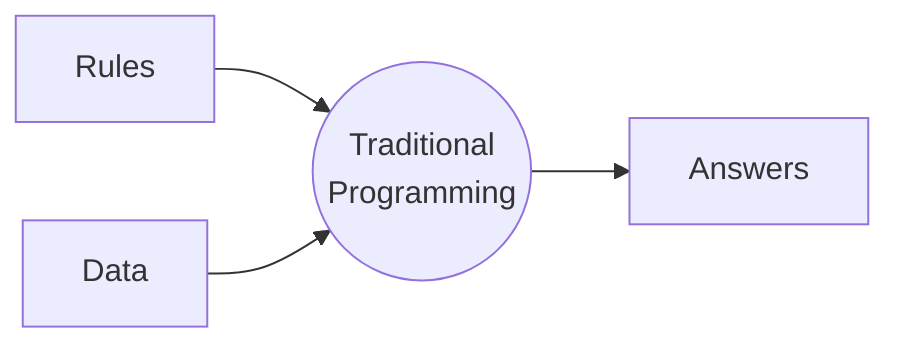
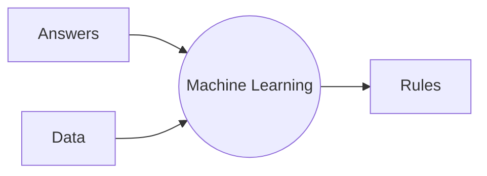

# Machine Learning

A new paradigm

::right::

- 💎 HARD 😱: code some complicated logic that tells apart a dog or a cat in a picture
- ✌ _"EASY"_ ✌: give **tons** of examples of dogs and cats, and have the machine discover patterns
  
